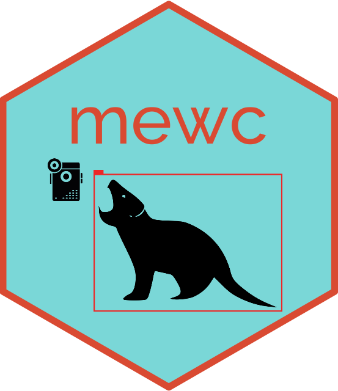

# MEWC - Mega Efficient Wildlife Classifier

## Introduction
This code repository contains example scripts for camera trap animal detection and classification. Our container based approach to camera trap image processing is modular, easily scalable, fast to deploy and reduces system prerequisites. Developed by RZA, JCB and BWB.

## Version 2 Updates

The base image [**mewc-flow**](https://github.com/zaandahl/mewc-flow) has been upgraded to `tensorflow/tensorflow:2.16.1-gpu` with CUDA, cuDNN and JAX support. This change has allowed a substantial upgrade to [**mewc-train**](https://github.com/zaandahl/mewc-train) and [**mewc-predict**](https://github.com/zaandahl/mewc-predict). Please visit the GitHub pages for these applications to see details about these changes. Older versions are still available with 1.0.x version tags.

## Quick Start Vignette
We have provided a [Quick Start Vignette](./vignette.md) that will guide you through the process of pulling necessary Docker images, training an EfficientNetV2 model using 10 species of Tasmanian animals and then using the trained model for inference to classify camera trap images from an example camera service. The entire process can be completed in an afternoon on a NVIDIA A100 Cloud GPU instance with the majority of that time devoted to training the classifier. 

## Example Scripts
The /examples directory contains command line scripts that can be run on an appropriate system. The scripts pull a Docker image from Docker Hub and then perform the processing on your camera trap image folder. For GPU support you need to use a current version of Linux or Windows 10/11. There are individual scripts to run each of the Docker images and a single script that will run all of the Docker images in sequence over a camera trap service. We provide example scripts for both Linux/Mac and Windows 10/11. You can find the bash scripts [here](./examples/bash/) and the PowerShell scripts [here](./examples/powershell/).

## Docker Hub Images
The Docker images are automatically built and pushed to [Docker Hub](https://hub.docker.com) using GitHub Actions for CI/CD. We adhere to [Semantic Versioning 2.0.0](https://semver.org) and maintain version consistency bewtween GitHub and Docker Hub tags. 

## Docker Source Code
The source code below is unnecessary if you just want to use the images. You can simply pull them from Docker Hub and use or modify one of the example scripts.

[**mewc-detect**](https://github.com/zaandahl/mewc-detect)

This Docker image contains the MegaDetector models md_v4.1.0.pb, md_v5a.0.0.pt and md_v5b.0.0.pt and is based on PyTorch 1.11.0, CUDA 11.3 and CUDNN8. Additionally it has TensorFlow to support MD4.1 and GPU support.

[**mewc-snip**](https://github.com/zaandahl/mewc-snip)

This Docker image is used to snip and save detections from a MegaDetector output JSON file and the original camera trap images.

[**mewc-train**](https://github.com/zaandahl/mewc-train)

This Docker image is used to train an EfficientNetV2 model. It is based on TensorFlow, CUDA and CUDNN8. The container is configured to use a GPU if available. 

[**mewc-predict**](https://github.com/zaandahl/mewc-predict)

This Docker image is used to predict the class of camera trap images using an EfficientNetV2 model. It is based on TensorFlow, CUDA and CUDNN8. The container is configured to use a GPU if available. 

[**mewc-exif**](https://github.com/zaandahl/mewc-exif)

This Docker image is used to write the class of camera trap images to the EXIF metadata. This is useful for sorting images based on class in camertrap database programs like Camelot.

[**mewc-box**](https://github.com/zaandahl/mewc-box)

This Docker image is used to draw bounding boxes on camera trap images using detections from a MegaDetector output JSON file. Additionally it will sort the original camera trap images into folders based on the MegaDetector detection type (human, animal, vehicle, blank). 

[**mewc-table**](https://github.com/BWBrook/mewc-table)

A streamlined, Docker-driven workflow for post-processing AI-classified wildlife camera trap data following processing by the MEWC system. This repository provides tools to integrate automated AI detection with human expertise, facilitating the refinement and analysis of species classification and camera-trap metadata, and for generating a consolidated service and site-attributes table.

## Docker Base Images
The base images are used to build the Docker images above. They are not intended to be used directly. 

[**mewc-flow**](https://github.com/zaandahl/mewc-flow)

A Docker base image that include TensorFlow, CUDA and CUDNN. It is used for EfficientNetV2 training and inference.

[**mewc-torch**](https://github.com/zaandahl/mewc-torch)

A Docker base image to support the MegaDetector Docker image. It also supports mewc-snip and mewc-box which use the MegaDetector utility libraries. 

## Docker Infrastrcture Ultilities
These Docker images are intended to be used as a toolset for building infrastructure in the cloud. You need to clone the repository and build the images locally as the code is directly used for Terraform plans and Ansible playbooks. 

[**mewc-infrastructure**](https://github.com/zaandahl/mewc-infrastructure)

A Docker image that contains Terraform, Ansible and OpenStack for Nectar Research Cloud infrastructure deployment. You will need to carefully read the README.md file in the repository to understand how to use this image.

## Logo Attributes

<a href="https://www.vecteezy.com/free-vector/camera-trap">Camera Trap Vectors by Vecteezy</a>

Vectors and icons by <a href="https://github.com/DiemenDesign/LibreICONS?ref=svgrepo.com" target="_blank">Diemen Design</a> in MIT License via <a href="https://www.svgrepo.com/" target="_blank">SVG Repo</a>

